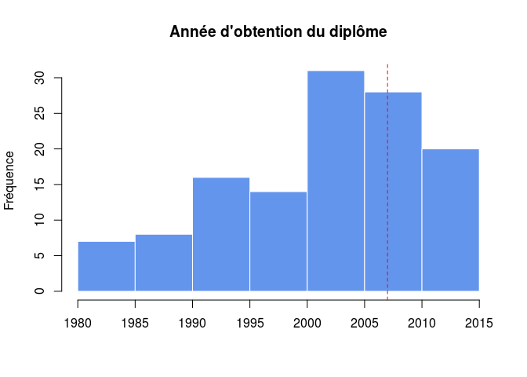
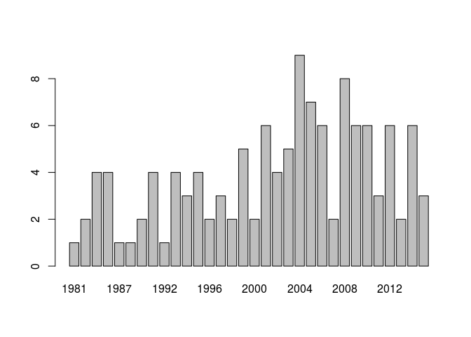
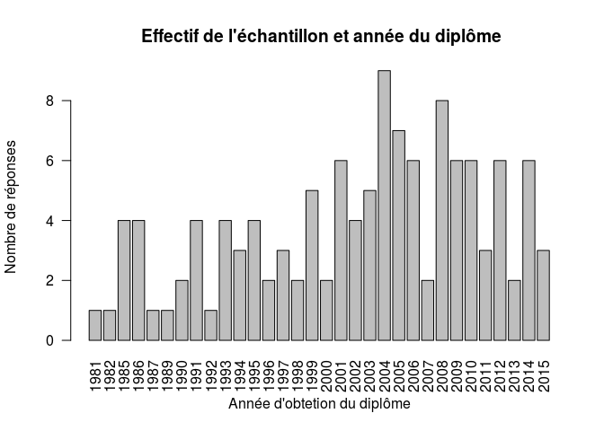

# Expression abdominale
JcB - Pauline DENNI  
29/01/2016  


- Nombre d'observations: 124
- Nombre de variables: 42


```
'data.frame':	124 obs. of  42 variables:
 $ obs  : int  1 2 3 4 5 6 7 8 9 10 ...
 $ andip: int  2008 1991 2012 2001 1991 2014 2004 2004 2004 2008 ...
 $ pp   : int  1 1 1 1 1 2 2 2 2 2 ...
 $ type : int  1 1 1 1 1 3 3 3 3 3 ...
 $ prat : int  1 1 1 1 1 0 1 1 1 1 ...
 $ rep  : int  0 1 0 0 1 NA 0 0 0 0 ...
 $ freq : num  5 2 5 1 1 0 1 0.3 1 0.5 ...
 $ arcf : int  1 1 0 1 1 NA 0 0 0 0 ...
 $ ds   : int  0 0 0 0 0 NA 0 0 0 0 ...
 $ dm   : int  1 0 1 0 0 NA 0 0 0 0 ...
 $ di   : int  1 1 0 0 0 NA 0 0 0 0 ...
 $ gyn  : int  0 0 0 0 0 NA 0 0 0 0 ...
 $ fat  : int  0 0 0 0 0 NA 1 0 0 0 ...
 $ dem  : int  1 1 1 1 1 NA 0 1 1 1 ...
 $ con  : int  1 1 1 1 1 1 1 1 1 1 ...
 $ etude: int  1 0 1 0 0 1 0 0 0 1 ...
 $ forma: int  0 0 0 0 0 0 0 0 1 0 ...
 $ prot : int  0 0 0 1 0 0 0 1 0 0 ...
 $ moyen: int  0 1 0 1 1 0 1 0 0 0 ...
 $ mac  : int  1 1 1 1 1 1 1 0 1 1 ...
 $ tete : int  1 1 1 0 1 0 0 0 0 1 ...
 $ instr: int  0 0 0 0 0 0 0 0 0 0 ...
 $ cesar: int  1 0 0 1 0 0 0 0 0 0 ...
 $ deliv: int  1 0 0 1 0 1 0 1 0 1 ...
 $ stres: int  1 1 1 1 1 1 1 1 1 1 ...
 $ doul : int  1 0 0 1 1 1 1 1 0 1 ...
 $ fract: int  1 1 1 1 1 0 1 1 1 1 ...
 $ dechi: int  0 1 1 1 1 0 0 1 0 1 ...
 $ rupt : int  0 0 0 1 0 0 0 0 1 1 ...
 $ embo : int  0 0 0 0 0 0 0 0 0 1 ...
 $ ru   : int  0 0 0 0 0 0 0 0 0 1 ...
 $ atoni: int  0 0 0 0 0 1 0 0 0 1 ...
 $ modif: int  1 1 1 1 1 1 1 1 1 1 ...
 $ aNAlg: int  0 0 0 0 0 0 0 0 1 0 ...
 $ delai: int  0 1 0 1 1 0 1 0 0 1 ...
 $ pos  : int  1 1 0 1 1 0 1 1 1 1 ...
 $ ocyto: int  1 0 0 0 0 0 1 0 0 0 ...
 $ ph   : int  0 0 0 0 0 0 0 0 0 0 ...
 $ epi  : int  0 0 0 0 0 0 0 0 1 0 ...
 $ vent : int  0 0 1 1 0 1 0 0 0 1 ...
 $ vecu : int  1 1 0 1 1 0 1 0 1 1 ...
 $ kiwi : int  2 2 2 0 2 2 0 2 2 2 ...
```

Année d'obtention du diplôme
============================


- Diplôme le plus ancien: 1981
- Diplôme le plus récent: 2015
- Année du diplôme non renseignée: 0 fois (0 %)



- diplômes antérieurs à 2007: 82
- diplômes depuis 2007: 42

Relation année du diplôme - expression
--------------------------------------

### Fréquence des expressions mensuelles en foction de 'année du diplôme

```r
# tableau croisé freq x année = 32 x 10. Chaque ligne correspond à un années. Les colonnes corrzspondent aux féquences mensuelles.
t <- table(d$andip, d$freq)
# exemple:
head(t)
```

```
##       
##        0 0.1 0.25 0.3 0.5 1 2 3 5 10
##   1981 0   0    1   0   0 0 0 0 0  0
##   1982 0   0    0   0   0 1 0 0 0  0
##   1985 2   0    0   0   0 1 1 0 0  0
##   1986 0   0    2   0   0 1 1 0 0  0
##   1987 0   0    0   0   0 1 0 0 0  0
##   1989 1   0    0   0   0 0 0 0 0  0
```

```r
# on calcule la somme de chaque ligne multipliée par la fréquence. La fréquence est connée par le nom des colonnes transformées en numérique:
t2 <- apply(t, 1, function(x){sum(x * as.numeric(colnames(t)))})
# on obtient un tableau à 2 colonnes: année x nb d'expression mensuelle
barplot(t2, las = 2, ylab = "Nombre d'expression par mois", xlab = "Année d'obtention du diplôme", main = "Expression utérine et année du diplôme")
```



```r
# alternative plus rapide avec aggregate:
# ag <- aggregate(d$freq, by=list(Annee = d$andip), FUN=sum)
# barplot(ag$x, names.arg = ag$Annee, las = 2)


# Cependant les effectifs annuels sont trop faibles pour tirer une conclusion: en moyenne 4 SF par année.
s <- apply(t, 1,  sum)
summary(s)
```

```
##    Min. 1st Qu.  Median    Mean 3rd Qu.    Max. 
##   1.000   2.000   4.000   3.844   6.000   9.000
```

```r
barplot(s, las = 2, ylab = "Nombre de réponses", xlab = "Année d'obtetion du diplôme", main = " Effectif de l'échantillon et année du diplôme")
```



Si on divise l'échantillon en 2 selon que le diplome ait été obtenu avant ou après 2007


```r
d$dip <- ifelse(d$andip < 2008, "<2007",">2007")
table(d$dip)
```

```
## 
## <2007 >2007 
##    84    40
```

```r
# table
t <- table(d$dip, d$freq)
t
```

```
##        
##          0 0.1 0.25 0.3 0.5  1  2  3  5 10
##   <2007 21   4    7   1  11 22 11  5  0  1
##   >2007 14   4    0   0   4 11  3  2  2  0
```

```r
fisher.test(t)
```

```
## 
## 	Fisher's Exact Test for Count Data
## 
## data:  t
## p-value = 0.2456
## alternative hypothesis: two.sided
```
Pas de différence de comportement selon que le diplôme ait été obtenu avant ou après 2007.

Selon le type de maternité
==========================


```r
table(d$type)
```

```
## 
##  1  2  3  4 
## 42 31 34 17
```

```r
t <- table(d$type, d$freq)
t
```

```
##    
##      0 0.1 0.25 0.3 0.5  1  2  3  5 10
##   1  8   1    4   0   4 13  6  4  2  0
##   2  4   3    1   0   3  9  7  3  0  1
##   3 17   2    2   1   2  9  1  0  0  0
##   4  6   2    0   0   6  2  0  0  0  0
```


